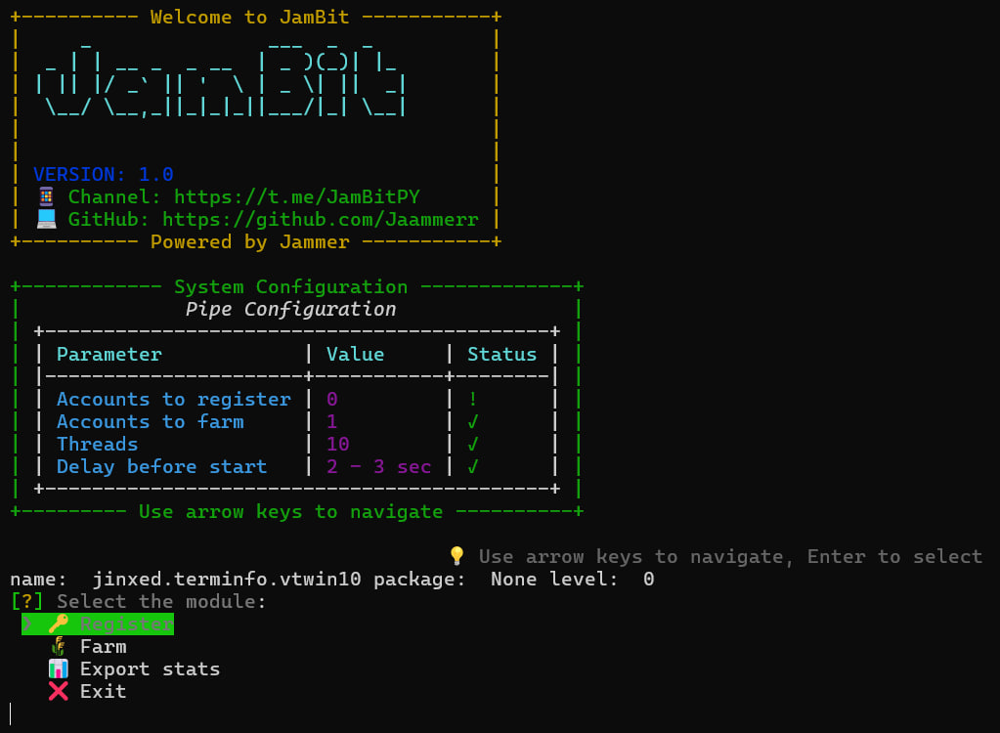

# 🌐 Pipe Network Bot [v1.0]

<div align="center">
  
  
  <p align="center">
    <a href="https://t.me/JamBitPY">
      
    </a>
    <a href="https://t.me/JamBitChat">
      
    </a>
  </p>
</div>

## 📋 Table of Contents
- [Features](#-features)
- [Requirements](#-requirements)
- [Installation](#-installation)
- [Configuration](#%EF%B8%8F-configuration)
- [Usage](#-usage)
- [Troubleshooting](#-troubleshooting)

## 🚀 Features

- 🔐 **Account Management**
  - ✅ Automatic account registration with referral system
  - 🔄 Smart login and session management
  - 📊 Comprehensive account statistics tracking
  
- 🤖 **Node Operations**
  - 📡 Automatic node testing and latency checks
  - ⚡ Optimized point earning system
  - 🔄 Advanced heartbeat mechanism
  
- 🛡️ **Security & Performance**
  - 🔒 Secure session management
  - 🌐 Full proxy support (HTTP/SOCKS5)
  - ⚡ Multi-threaded operations

## 💻 Requirements

- Python 3.10-3.11
- Stable internet connection
- Working proxies (HTTP/SOCKS5)

## 🛠️ Installation

1. **Clone the Repository**
   ```bash
   git clone [repository URL]
   ```

2. **Set Up Virtual Environment**
   ```bash
   python -m venv venv
   source venv/Scripts/activate  # Windows
   source venv/bin/activate      # Unix/MacOS
   ```

3. **Install Dependencies**
   ```bash
   pip install -r requirements.txt
   ```

## ⚙️ Configuration

### 📁 settings.yaml

```yaml
# Core Configuration
threads: 30                    # Number of concurrent threads
keepalive_interval: 120        # Interval between node tests (seconds)
heartbeat_interval: 24         # Heartbeat interval (hours)
referral_codes:               # List of referral codes to use
  - ""                        # Add your codes here

# Display Settings
show_points_stats: true       # Show points after each operation

# Startup Settings
delay_before_start:
  min: 2                      # Minimum startup delay (seconds)
  max: 3                      # Maximum startup delay (seconds)
```

### 📁 Input Files Structure

#### data/farm.txt
```
email:password
email:password
```

#### data/register.txt
```
email:password
email:password
```

#### data/proxies.txt
```
http://user:pass@ip:port
socks5://user:pass@ip:port
```

## 📊 Stats Export

The bot includes functionality to export comprehensive statistics for your accounts:
- Total points earned
- Referral URLs

## 🚀 Usage

1. Configure the settings.yaml file with your preferences
2. Add your accounts and proxies to the respective files
3. Start the bot:
   ```bash
   python run.py
   ```


## 🔧 Troubleshooting

### Common Issues and Solutions

#### 🔑 Login Problems
- Verify account credentials
- Check proxy functionality
- Ensure account is not banned

#### 🌐 Node Testing Issues
- Verify network connectivity
- Check proxy response times
- Ensure proper keepalive intervals

#### 🐦 Twitter Binding Problems
- Verify Twitter tokens
- Check account eligibility
- Ensure Twitter account is active


